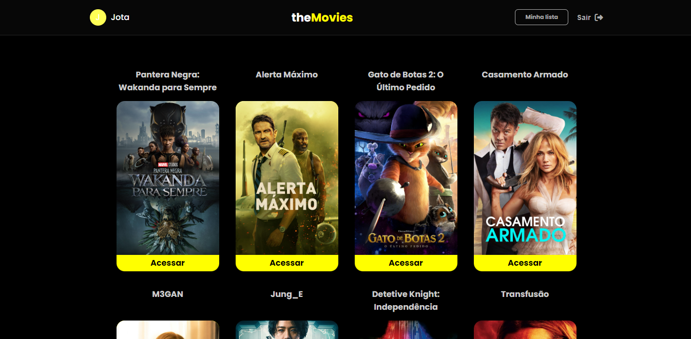

<h1 align="center">Catálogo de filmes - Diogo Jorge</h1>

<h1 align="center">
    <a href="https://diogofernandoj-movies.netlify.app/" target="blank">
        
        <small align="center">Clique para visitar o projeto🔗</small>
    </a>
</h1>

## 📕 Sobre

Unindo todos os conceitos que aprendi em um curso React, resolvi desenvolver esse Catálogo de filmes, com criação de contas e validação de login através do Firebase, além de consumo de uma API gratuita, para pegar os dados dos filmes, Context para acessar os dados do usuário, tais como Username e Filmes adicionado a lista, e diversos Hooks como react-router, react-hook-form, entre outros.

## 📃 Site

Para iniciar uma sessão, você deve se cadastrar utilizando nome, email e senha. Dentro do home, você pode acessar um filme para ler sua sinopse, assistir o trailer e salvar ou remover de sua lista. Clique no botão sair para deslogar de sua conta.

## ⚙ Ferramentas utilizadas

Para este projeto utilizei as seguintes tecnologias:

- React
- Firebase
- Context API
- react-router-dom
